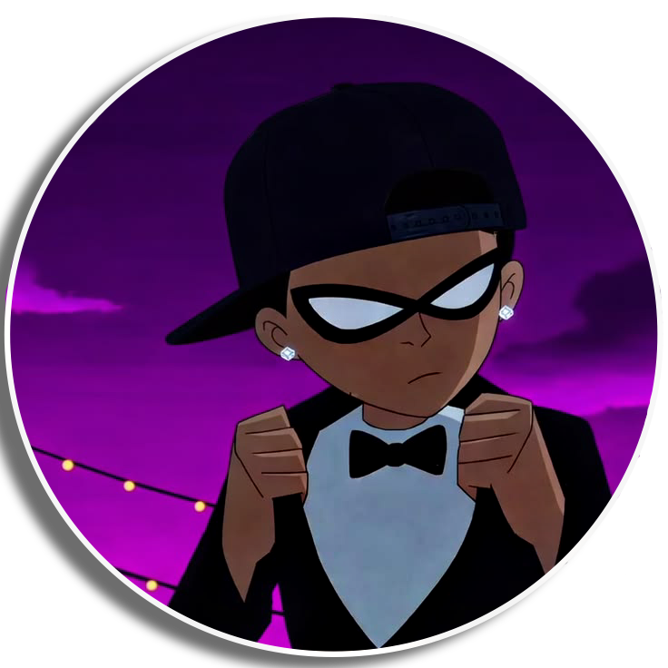

<div align="center">
  

  <h1>JXNN. STUDIO</h1>

  <p><strong>YOUR STORY. CUT SHARPER.</strong></p>
  <p>Cinematic, high-retention video editing for creators and brands.</p>

  <p>
    
    
  </p>
</div>

---

## The studio

JXNN. Studio turns raw footage into sharp, high-retention stories through purposeful pacing, clean sound, motion design and platform-ready finishing.

This repository contains the complete studio portfolio: selected edits, thumbnail work, service rates, production information and contact routes.

> **Built to feel like an editing timeline — dark, dimensional and always in motion.**

## Selected clients

| Client | Work |
| --- | --- |
| [OkHarry](https://twitch.tv/okharry) | Gaming, IRL editing and thumbnail design |
| [Beta Squad](https://www.youtube.com/@BetaSquad) | Entertainment subtitles and post-production |

## Services

- Long-form YouTube editing
- TikTok, Reels and YouTube Shorts
- Motion design and animated graphics
- Subtitles and retention-led formatting
- Sound design, colour and final delivery
- High-click-through thumbnail design

## Design system

| Element | Direction |
| --- | --- |
| Visual language | Cinematic dark interface with glass panels and editorial spacing |
| Accent palette | Acid green `#C8FF32` and violet `#8D68FF` |
| Motion | Scroll reveals, progress feedback and interactive CSS 3D scenes |
| Typography | Manrope paired with DM Mono |
| Experience | Responsive, keyboard accessible and reduced-motion friendly |

The site is built with semantic HTML, modern CSS and lightweight vanilla JavaScript. It has no framework or build-step dependency.

## Project structure

```text
work-rates/
├── index.html          # Main studio portfolio and showreel
├── rates.html          # Editing and thumbnail pricing
├── thumbnail.html      # Thumbnail portfolio and lightbox
├── faq.html            # Production questions and answers
├── contact.html        # Structured project enquiry form
├── admin.html          # Private authenticated enquiries dashboard
├── privacy.html        # Project-form privacy notice
├── tos.html            # Terms of service
├── 404.html            # Custom missing-sequence page
├── theme.css           # Shared secondary-page design system
├── shared.js           # Scroll, reveal, gallery and mobile-menu interactions
├── contact.js          # Secure Supabase enquiry submission
├── admin.js            # Private enquiry dashboard controls
├── supabase-config.js  # Browser-safe project connection values
├── supabase-schema.sql # Enquiry table and access policies
└── assets/             # Logos, social card, client images and portfolio artwork
```

## Run locally

Open the project folder in VS Code and select **Go Live**, or open `index.html` directly in a browser.

Keep `theme.css`, `shared.js` and every HTML page in the same folder. The `assets` directory should remain beside them.

The enquiry form stores briefs in Supabase. Database row-level security allows public inserts but restricts reading and updating to the approved studio email. Never place a Supabase `service_role` or secret key in this repository.

## Contact

<div align="center">

[](https://jxnn.store/contact.html)
[](https://discord.gg/qgJNMFy3F6)
[](https://instagram.com/jaxongarforth1)
[](https://x.com/jxnn122)

<sub>© 2026 JXNN. STUDIO — CUT DIFFERENT.</sub>

</div>
